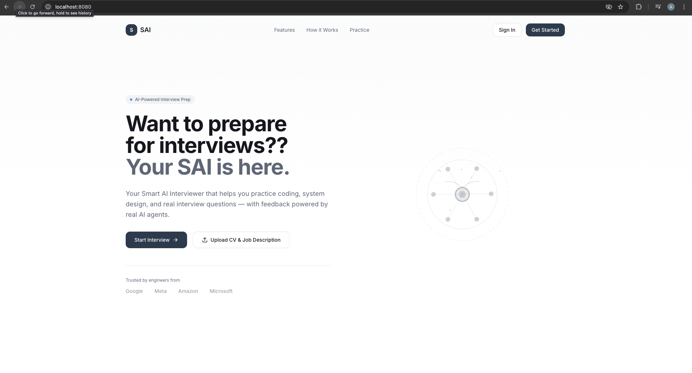
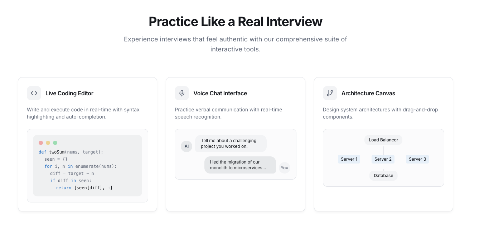
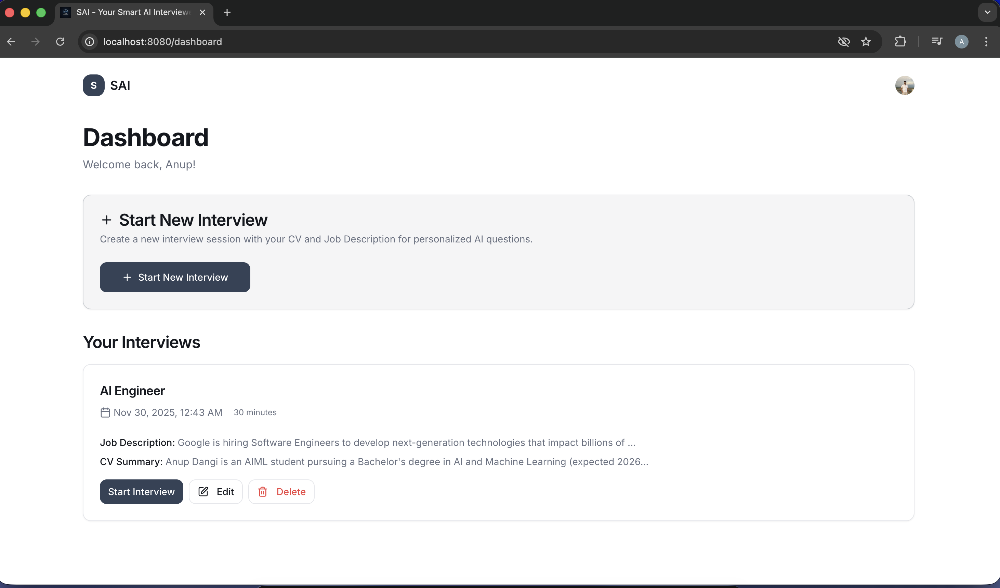
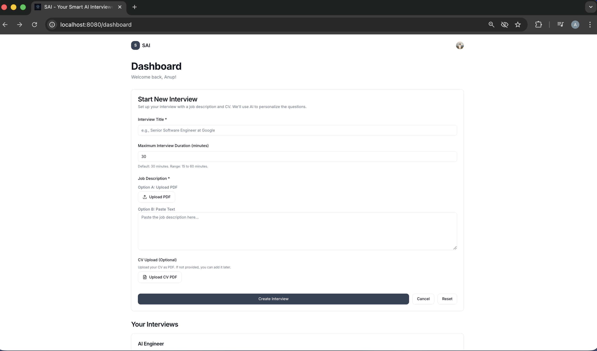
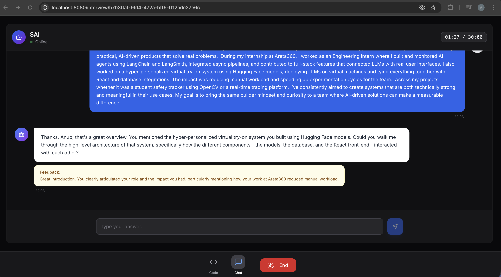
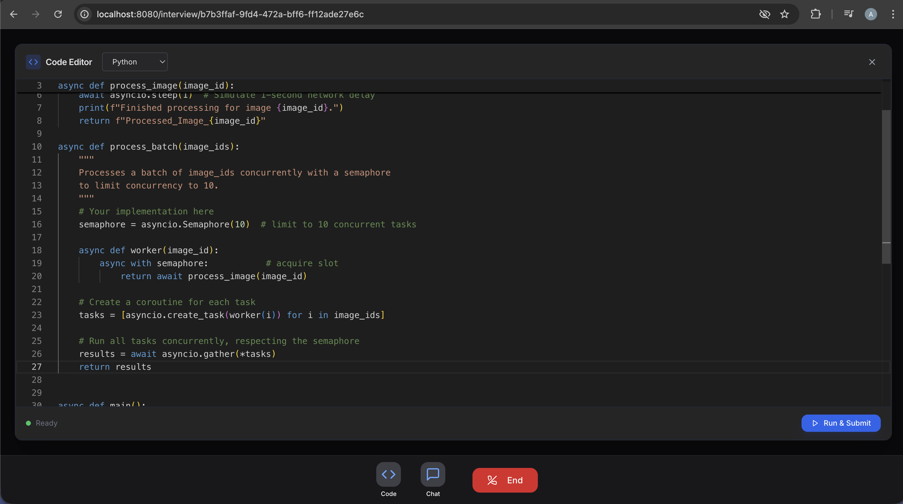
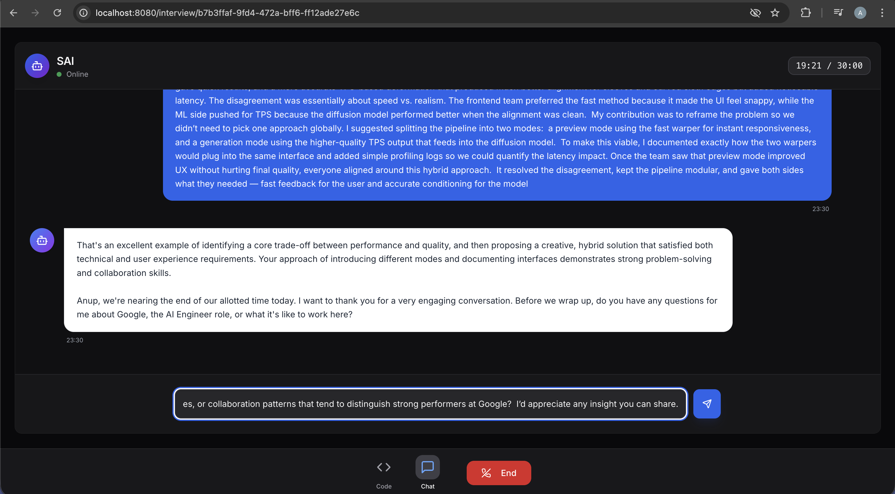
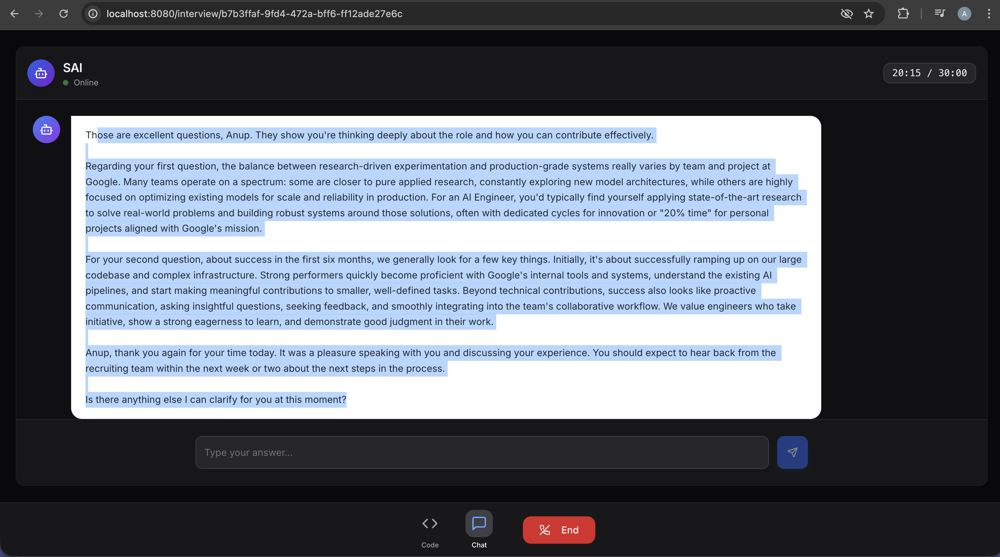
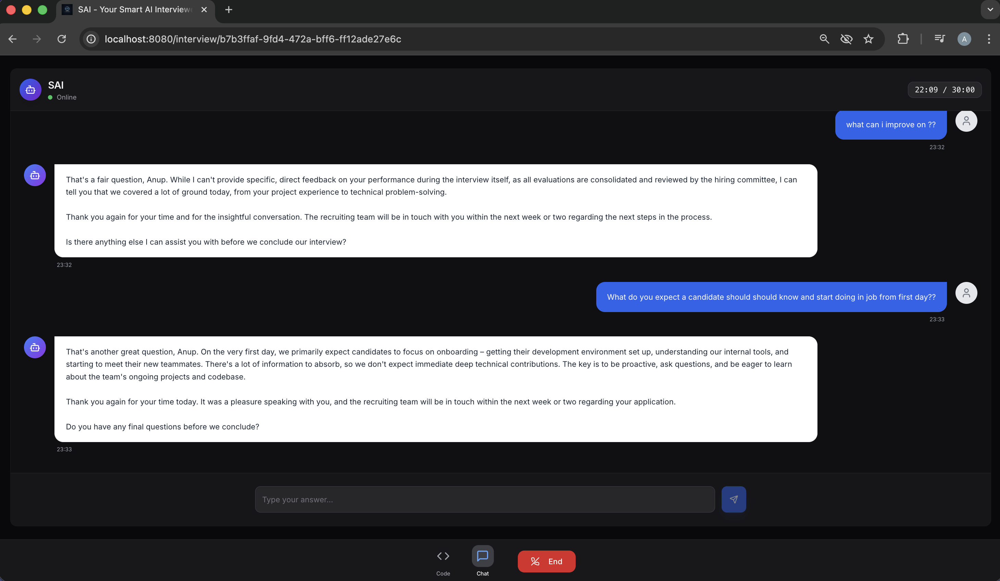

# Smart AI Interviewer (SAI)

**Your Intelligent, Adaptive Technical Interview Coach.**

## Overview
Smart AI Interviewer (SAI) is a sophisticated, multi-agent system designed to simulate realistic technical interviews. Powered by Google's Agent Development Kit (ADK) and Gemini models, SAI provides candidates with a safe, rigorous environment to practice coding, system design, and behavioral questions, receiving actionable feedback in real-time.

## Problem Statement
Technical interviews are high-stakes and stressful. Candidates often struggle not because of a lack of skill, but due to a lack of realistic practice. Existing solutions are either static (question banks) or lack depth (generic chatbots that don't understand interview flow or code execution).

## Solution Summary
SAI solves this by creating an **adaptive interview experience**. It analyzes your Resume (CV) and Job Description (JD) to tailor questions. It uses a **Coordinator Agent** to manage the interview lifecycle (Intro -> Technical -> Behavioral -> Closing) and a specialized **Coding Agent** to verify technical solutions via real-time code execution.

## Core Features of the MVP
*   **Context-Aware**: Ingests PDF/TXT Resumes and Job Descriptions to generate relevant questions.
*   **Adaptive Difficulty**: Adjusts question complexity based on candidate performance.
*   **Live Code Execution**: Integrated code editor (Monaco) where candidates can write and run code (Python, C++, Java, C), verified by the AI.
*   **Structured Feedback**: Provides immediate feedback on answers and a comprehensive summary at the end of the session.
*   **Session Persistence**: Seamlessly pause and resume interviews using Neon Postgres and ADK session management.

## Technical Architecture

### System Architecture
High-level overview of the application components and data flow.

```mermaid
graph TD
    User[User] -->|Interact| UI[Frontend (React + Vite)]
    UI -->|REST API| API[Backend (FastAPI)]
    
    subgraph "External Services"
        Auth[Clerk Auth]
        LLM[Google Gemini API]
        Exec[Piston Code Execution]
    end
    
    subgraph "Data Persistence"
        DB[(Neon Postgres)]
    end
    
    API -->|Verify Token| Auth
    API -->|Store/Fetch| DB
    API -->|Generate| LLM
    API -->|Run Code| Exec
```

### Agent Architecture
Detailed view of the multi-agent system powered by Google ADK.

```mermaid
flowchart TB
    subgraph "Orchestration (Coordinator)"
        Coord[Coordinator Agent]
        State[Interview State Machine]
        Mem[In-Session Memory]
        
        Coord -->|Updates| State
        Coord -->|Reads/Writes| Mem
    end
    
    subgraph "Specialized Agents"
        Coord --"Delegates Coding Tasks"--> Coder[Coding Agent]
    end
    
    subgraph "Google ADK & Tools"
        Runner[ADK Runner]
        Tool[Code Execution Tool]
        
        Coder -->|Uses| Tool
        Coord -->|Runs via| Runner
        Coder -->|Runs via| Runner
    end
    
    subgraph "Models"
        Flash[Gemini 2.5 Flash\n(Conversation)]
        Pro[Gemini 2.5 Pro\n(Reasoning/Coding)]
        
        Coord -.-> Flash
        Coder -.-> Pro
    end
```

### Components
*   **Frontend**: React + Vite + TailwindCSS. Provides a Zoom-like interface with chat, video feed (avatars), and a split-screen code editor.
*   **Backend**: FastAPI. Handles API requests, manages agent lifecycles, and interfaces with the database.
*   **Database**: Neon (Serverless Postgres). Stores user profiles, interview metadata, and chat history.
*   **AI Engine**: Google ADK (Python) wrapping Gemini 2.5 models.

## How the Agent System Works

### Google ADK Integration
SAI leverages the **Google Agent Development Kit (ADK)** to structure agent behaviors. We utilize `LlmAgent` for the core logic and `Runner` for managing the event loop.

### InSessionMemory & Persistence
*   **Short-term**: `InterviewMemory` (a custom class) tracks the immediate interview state: current stage (e.g., "technical"), question count, and topics covered. This is passed to the ADK `Runner` to maintain context across turns.
*   **Long-term**: All messages and state changes are persisted to **Neon Postgres**. When a user resumes a session, the system rehydrates the ADK agent with the historical context from the DB.

### Interview ID Flow
1.  User starts an interview -> Unique `interview_id` generated.
2.  Each specific attempt creates a `session_run_id`.
3.  The backend loads the CV/JD context associated with the `interview_id`.
4.  The `CoordinatorAgent` initializes with this context and the `session_run_id` to ensure continuity.

## Multi-Agent & Key Concepts

This project implements several advanced agentic patterns:

*   **Multi-Agent System**:
    *   **Coordinator Agent**: The "Interviewer." Manages the script, transitions between stages, and evaluates soft skills.
    *   **Coding Agent**: The "Tech Lead." Specialized in generating, debugging, and executing code.
*   **Sequential Flow**: The Coordinator hands off control to the Coding Agent when a coding task is identified, and takes it back for behavioral questions.
*   **Tool Use**:
    *   `execute_code`: A custom tool allowing the Coding Agent to run user code in a sandboxed environment (Piston).
*   **Context Handling**: Dynamic injection of CV/JD summaries into the system prompt ensures every question is personalized.

## Implementation Details

*   **`backend/src/agents/coordinator.py`**: Contains the logic for the main interviewer persona, state machine for interview stages, and prompt engineering.
*   **`backend/src/agents/coding.py`**: Extends `BaseAgent` with code execution tools and specific instructions for technical verification.
*   **`backend/src/tools/code_execution.py`**: Implements the interface to the Piston code execution API.
*   **`backend/main.py`**: FastAPI entry point, handling routes for `/start`, `/messages`, `/end`, and `/memory`.

## Setup Instructions

### Prerequisites
*   Node.js & npm
*   Python 3.10+
*   PostgreSQL (or Neon account)
*   Google Cloud Project (for Gemini API)
*   Clerk Account (for Auth)

### 1. Clone & Install
```bash
git clone https://github.com/yourusername/SmartAIInterviewer.git
cd SmartAIInterviewer
```

### 2. Backend Setup
```bash
cd backend
python -m venv venv
source venv/bin/activate  # or venv\Scripts\activate on Windows
pip install -r requirements.txt
```

### 3. Frontend Setup
```bash
cd ../sai-interview-prep
npm install
```

### 4. Environment Variables
Create `.env` files in both `backend/` and `sai-interview-prep/` (see `.env.example`).
**Backend keys needed**: `GOOGLE_API_KEY`, `DATABASE_URL`, `CLERK_SECRET_KEY`, `CLERK_PUBLISHABLE_KEY`.
**Frontend keys needed**: `VITE_CLERK_PUBLISHABLE_KEY`, `VITE_API_URL`.

### 5. Run Locally
**Backend**:
```bash
cd backend
uvicorn main:app --reload
```
**Frontend**:
```bash
cd sai-interview-prep
npm run dev
```

## API Endpoints

*   `POST /api/interviews/{id}/start`: Initialize a new session.
*   `POST /api/interviews/{id}/messages`: Send user message / Get AI response.
*   `POST /api/interviews/{id}/end`: Conclude interview and generate summary.
*   `GET /api/interviews/{id}/memory`: Retrieve parsed CV/JD context.

## Usage Guide

1.  **Dashboard**: Upload your Resume (PDF) and the Job Description.
2.  **Start**: Click "Start Interview". The AI will analyze your docs and greet you.
3.  **Interview**: Answer questions via chat.
4.  **Code**: If asked to code, open the Code Editor, write your solution, and click "Run" to test it.
5.  **Finish**: Click "End Interview" to receive a detailed performance report.

## Future Enhancements
*   **Audio Mode**: Real-time voice interaction for a more immersive experience.
*   **Diagramming**: Ability to upload or draw system design architecture diagrams for AI analysis.
*   **IDE Integration**: VS Code extension for practicing directly in a real environment.

## Limitations
*   Currently text-first (voice is planned).
*   Code execution is limited to languages supported by Piston (Python, C++, Java, C, JS).
*   Gemini API rate limits apply.

## Contributing
Contributions are welcome! Please fork the repository and submit a Pull Request.

## License
MIT License.

## Acknowledgements
*   **Google Gemini** for the LLM capabilities.
*   **Google ADK** for the agent framework.
*   **Neon** for serverless database infrastructure.
*   **Clerk** for seamless authentication.

## Project Gallery

### 1. Dashboard & Upload


### 2. Interview Setup


### 3. Interview Interface


### 4. Chat Interaction


### 5. AI Response


### 6. Code Editor


### 7. Coding Task


### 8. Code Execution


### 9. Session Summary


### 10. Performance Report

